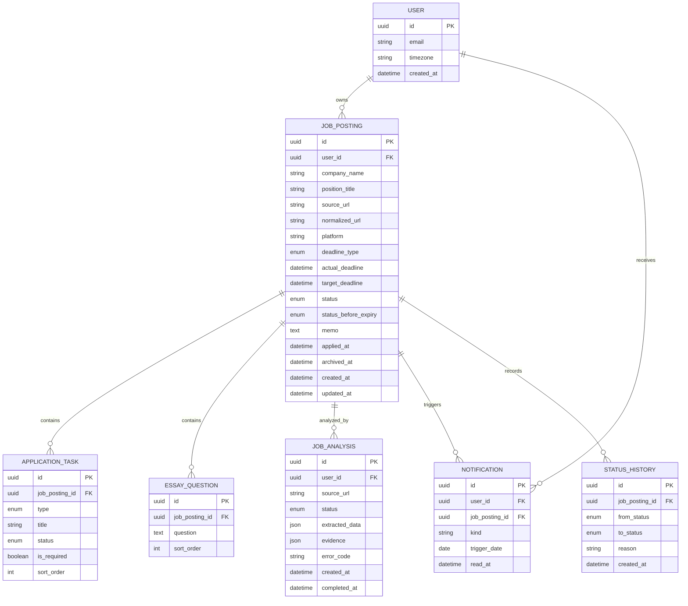

# 업무 규칙 및 데이터 모델

## 1. 상태 정의

### ApplicationStatus

- SAVED: 검토 또는 준비 전
- IN_PROGRESS: 하나 이상의 준비 작업을 진행 중
- APPLIED: 외부 사이트에서 지원 완료
- EXPIRED: 실제 마감을 지났으며 미지원
- ARCHIVED: 사용자가 목록에서 보관

`EXPIRED`는 매 조회 시 계산만 하지 않고 일괄 작업으로 갱신하되, 원래 상태를 `statusBeforeExpiry`에 보관한다.

### TaskStatus

- TODO
- IN_PROGRESS
- DONE
- NOT_REQUIRED

### DeadlineType

- FIXED
- ALWAYS_OPEN
- UNKNOWN

## 2. 핵심 규칙

- 서버 저장 시각은 UTC다.
- FIXED는 마감 시각과 원문 시간대 정보를 보존한다.
- 날짜만 있는 마감은 사용자에게 확인받아 해당 지역 23:59로 저장한다.
- targetDeadline은 actualDeadline 이후일 수 없다.
- APPLIED는 실제 마감 후에도 유지된다.
- ARCHIVED는 자동으로 EXPIRED가 되지 않는다.
- 진행률 분모는 `isRequired=true`이고 `status != NOT_REQUIRED`인 작업이다.
- 분모가 0이면 진행률은 null이며 UI에 `작업 미설정`으로 표시한다.
- APPLIED와 준비 진행률은 독립적이다.

## 3. 관계 모델

## 4. 제약과 인덱스

- 모든 하위 데이터는 jobPosting의 userId 소유권을 통해 접근을 제한한다.
- `(user_id, normalized_url)` 인덱스로 중복 검색을 지원한다. URL이 null이면 제외한다.
- `(user_id, status, target_deadline)` 및 `(user_id, status, actual_deadline)` 인덱스를 둔다.
- Notification은 `(user_id, job_posting_id, kind, trigger_date)`를 유일하게 한다.
- Task의 `(job_posting_id, sort_order)`를 인덱싱한다.

## 5. 삭제 정책

기본 UI는 복구 가능한 보관을 사용한다. 영구 삭제 시 공고의 작업·문항·알림·상태 이력을 함께 삭제한다. AI 분석 원문을 저장한다면 별도 보존 기간을 두며, 사용자의 계정 삭제 요청 시 연결 데이터를 제거한다.

